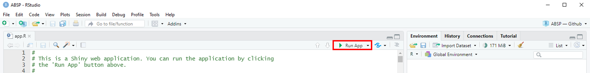

# ABSP - Analysis of Bisulfite Sequencing PCR

ABSP, standing for *"Analysis of Bisulfite Sequencing PCR"*, is an R based tool to analyze CpG methylation profiles using data from Bisulfite Sequencing PCR (BSP) experiment results. 
It was developed to help researchers to estimate and compare methylation percentages of a DNA region studied using BSP experiments. 
It provides a complete automated workflow, from trace file sequencing results to data visualization and statistics.

For more detailed information, please read the [**ABSP User Guide**](https://github.com/ABSP-methylation-tool/ABSP/blob/813568d14944b20488cc01582a61dfbd602f744c/ABSP%20User%20Guide.pdf) document.

 

## Citation

If you use ABSP in your published work, please cite
> **Denoulet et al. (2023), ABSP: an automated R tool to efficiently analyze region-specific CpG methylation from bisulfite sequencing PCR, Bioinformatics, Volume 39, Issue 1, btad008, [https://doi.org/10.1093/bioinformatics/btad008](https://doi.org/10.1093/bioinformatics/btad008)**

 

## Availability

ABSP was developed on a Windows machine but is functional on MacOS and Linux devices. Please note that on Linux machine, the packages installation at the first opening of ABSP can take a long time.

 

## Quick start guide

### Installation

* Download the ABSP files from github ("Code", "Download Zip") and unzip the folder
* Install software: **R** at [https://www.r-project.org/](https://www.r-project.org/) and **RStudio** at [https://www.rstudio.com/products/rstudio/download/](https://www.rstudio.com/products/rstudio/download/)

### Open the ABSP app

* Open the "**ABSP Rproject.Rproject**" file with Rstudio
* Open the "**app.R**" file with Rstudio
* Click on the "**Run App**" button at the top right corner (you can select "Run external" to open it in web browser)
* If a pop-up window appears about the shiny package, click on "**Yes**" to accept the shiny package installation

### Analysis with ABSP

Find example data of inputs and outputs in the "examples" folder.

#### Individual sample analysis: 

* In the "Individual analysis" tab, fill the entries and add input files (reference sequence .fasta file and sequencing .ab1 files)
* Run the analysis to compute the CpG methylation levels of your sample 
* View the results in the .html report generated in your "reports" folder
* Look for output files in your "results" folder

#### Grouped samples analysis:

* Once all of your samples have been individually analyzed, in the "Grouped analysis" tab, fill the entries and choose your parameters for plotting
* Run the analysis to gather samples, generate visualization plots (lollipop plots) and compare methylation data between groups by comparative statistics
* View the results in the .html report generated in your "reports" folder
* Look for output files in your "results" folder

#### Launch multiple analysis:  

The "Multiple analysis" tab is useful to analyze multiple samples and/or for multiple grouping analysis, launched in one click, using as input tables filled with the required input entries.

 

## License

ABSP, Analysis of Bisulfite Sequencing PCR  
Copyright © 2022 by the CANTHER laboratory, France (absp@univ-lille.fr)  
Released under the GPL-3 license.  
This program is free software: you can redistribute it and/or modify it under the terms of the GNU General Public License as published by the Free Software Foundation,
either version 3 of the License, or (at your option) any later version. This program is distributed in the hope that it will be useful, but WITHOUT ANY WARRANTY;
without even the implied warranty of MERCHANTABILITY or FITNESS FOR A PARTICULAR PURPOSE. See the GNU General Public License for more details.  
You should have received a copy of the GNU General Public License along with this program. If not, see [https://www.gnu.org/licenses/](https://www.gnu.org/licenses/).
