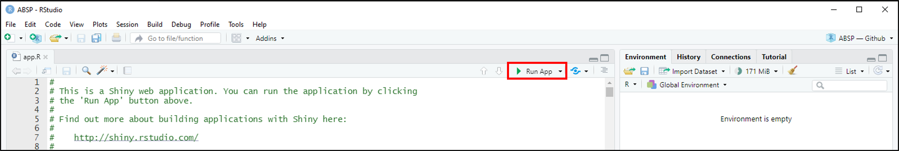

[](https://www.gnu.org/licenses/gpl-3.0.en.html)

# ABSP - Analysis of Bisulfite Sequencing PCR


ABSP,  which stands for *"Analysis of Bisulfite Sequencing PCR"*, is an R-based tool designed to analyze CpG methylation profiles using data from Bisulfite Sequencing PCR (BSP) experiments. 
It was developed to assist researchers in estimating and comparing methylation percentages of a DNA regions studied through BSP experiments.
ABSP offers a comprehensive automated workflow, spanning from trace file sequencing results to data visualization and statistical analysis.

**Contents:**

* [Citation](#citation)
* [Availability](#availability)
* [Quick start guide](#quick-start-guide)
  - [Installation](#installation)
  - [Open the ABSP app](#open-the-absp-app)
  - [Analysis with ABSP](#analysis-with-absp)
* [FAQ - Frequently Asked Questions](#faq---frequently-asked-questions)
  - [1. My reference genome is not available, what can I do ?](#1-my-reference-genome-is-not-available-what-can-i-do-)
  - [2. My reference sequence doesn't exist in a reference genome (e.g. custom reporter sequence), what can I do ?](#2-my-reference-sequence-doesnt-exist-in-a-reference-genome-eg-custom-reporter-sequence-what-can-i-do-)
  - [3. Why is my sequence too short after trimming, and how can I fix it ?](#3-why-is-my-sequence-too-short-after-trimming-and-how-can-i-fix-it-)
* [Licence](#license)

For further detailed information, please read the [**ABSP User Guide**](https://github.com/ABSP-methylation-tool/ABSP/blob/813568d14944b20488cc01582a61dfbd602f744c/ABSP%20User%20Guide.pdf) document.

<br>

## Citation

If you use ABSP in your published work, please cite:
> **Denoulet *et al.* (2023), ABSP: an automated R tool to efficiently analyze region-specific CpG methylation from bisulfite sequencing PCR, *Bioinformatics*, Volume 39, Issue 1, btad008, [https://doi.org/10.1093/bioinformatics/btad008](https://doi.org/10.1093/bioinformatics/btad008)**

<br>

## Availability

ABSP was initially developed on a Windows machine but has been tested and confirmed to be is functional on MacOS and Linux devices as well. Please be aware that on Linux machine, the package installation during the first launch of ABSP may take a considerable amount of time.

<br>

## Quick start guide

### Installation

* Download the ABSP files from GitHub (Go to "Releases" in the right panel and in the "Assets" section of the latest release, download the ABSP .zip or .tar.gz
 file) and extract/unzip the folder
* Install software: **R** at [https://www.r-project.org/](https://www.r-project.org/) and **RStudio** at [https://www.rstudio.com/products/rstudio/download/](https://www.rstudio.com/products/rstudio/download/)

### Open the ABSP app

* Open the "**ABSP Rproject.Rproject**" file with Rstudio
* Open the "**app.R**" file with Rstudio
* Click on the "**Run App**" button at the top right corner  of the RStudio window (in the "Run App" dropdown menu you can select "Run external" to open the app in web browser instead of within the RStudio window or viewer pane, if it better suits your preference)
* If prompted with a pop-up window regarding the shiny package installation, click "**Yes**" to proceed with installing the shiny package


### Analysis with ABSP

You can locate example data for both inputs and outputs in the "examples" folder.

#### Individual sample analysis: 


* Navigate to the "Individual analysis" tab and complete the entries and add input files such as the reference sequence in .fasta format and sequencing files in .ab1 format.
* Proceed to run the analysis to compute the CpG methylation levels of your sample 
* Once the analysis is complete, review the results in the .html report generated in your "reports" folder
* Finally, find the output files in your "results" folder for further examination


#### Grouped samples analysis:


* After individually analyzing all of your samples, navigate to the "Grouped analysis" tab and complete input entries and select your parameters for plotting.
* Proceed to run the analysis which will gather samples, generate visualization plots (lollipop plots) and compare methylation data between groups using comparative statistics
* Once the analysis is complete, review the results in the .html report generated in your "reports" folder
* Finally, locate the output files in your "results" folder for further examination


#### Launch multiple analyses:  


The "Multiple analyses" tab is useful to analyze multiple samples and/or for multiple grouping analysis, launched in one click, using as input tables filled with the required input entries.

<br>

## FAQ - Frequently Asked Questions

### 1. My reference genome is not available, what can I do ? 
First, the reference genome is only necessary for visualization of the reference sequence in genomic plots but it is not needed for computing methylation percentages.

Still, there are several possibilities:  
1. **Simplest option: Using an arbitrary reference genome**  
You can employ ABSP with an arbitrary genome, ideally one that closely resembles the actual reference genome. This choice does not affect computation results but impacts visualization in plots and the coordinates displayed in plots/tables. By setting your coordinates to "chr1:1-XXX" (where "XXX" represents the length of your sequence), the sequence will surely correspond to a series of N nucleotides, which will be displayed in grey in genomic plots. For output results, as coordinates are arbitrarily set, they must not be taken into consideration in tables or plots.  Therefore, it is recommended to choose either the "CpG numbers" or "None" options for CpG position labels in the Grouped Analysis.

2. **Accessible option: Using an arbitrary reference genome with minor code ajustements**  
You can make several adjustments to ensure correct coordinates with an arbitrary genome:
- Remove the sequence track in the genomic plots by modifying the `ABSP_functions.R` script, in the `individual_meth_plot()` (line 499) and `genomic_plot()` (line 1172) functions. This consists in removing the `sTrack` object in the `plotTracks()` function at lines 521 and 1285.
- Changing colors of nucleotides in genomic plots to grey by modifying the `bases_colors` object in the `ABSP_individual_analysis.Rmd` script, (line 365) and in the `ABSP_grouped_analysis.Rmd` script (line 361).

3. **Advanced option: Using your own assemblies instead of a reference genome**  
For genomic plots, the Gviz package works best with a [BSgenome](https://bioconductor.org/packages/devel/bioc/vignettes/Gviz/inst/doc/Gviz.html#48_SequenceTrack). Although a `DNAStringSet` object can replace the BSgenome, but for simplicity whithin ABSP, it needs to be manually added directly within the plot function (you can check for the `DNAStringSet` class from [Biostings](https://kasperdanielhansen.github.io/genbioconductor/html/Biostrings.html), and `SequenceTrack` class from [Gviz](https://rdrr.io/bioc/Gviz/man/SequenceTrack-class.html)). Below is a an example.

**Example with [cs10]( https://ftp.ncbi.nlm.nih.gov/genomes/all/GCF/900/626/175/GCF_900626175.2_cs10/GCF_900626175.2_cs10_genomic.fna.gz) assembly :**  
To test the `readDNAStringSet()` function before running ABSP with the [Biostings](https://kasperdanielhansen.github.io/genbioconductor/html/Biostrings.html) package installed: (replace file path)
```r
install.packages("BiocManager")
BiocManager::install("Biostrings")
library(Biostrings)

# Replace "/PATH/TO/FOLDER/GCF_900626175.2_cs10_genomic.fna.gz" with the actual file path
cs10 <- readDNAStringSet("/PATH/TO/FOLDER/GCF_900626175.2_cs10_genomic.fna.gz")
```

The incorporation of the new assembly must be added at two locations:

* In the `ABSP_function.R` script, apply these modifications in the `individual_meth_plot()` function (line 515):
```r
cs10 <- readDNAStringSet("/PATH/TO/FOLDER/GCF_900626175.2_cs10_genomic.fna.gz") # replace path
seqlevels(cs10)[1:10] <- c("chr1","chr2","chr3","chr4","chr5","chr6","chr7","chr8","chr9","chrX") # select and rename chromosomes

# Sequence track
  sTrack <- SequenceTrack(sequence = cs10, add53=F , noLetters=T, fontcolor=bases_colors) # modify sequence and/or genome
```
* In the `ABSP_function.R` script, apply these modifications in the `genomic_plot()` function (line 1263):
```r
cs10 <- readDNAStringSet("/PATH/TO/FOLDER/GCF_900626175.2_cs10_genomic.fna.gz") # replace path
seqlevels(cs10)[1:10] <- c("chr1","chr2","chr3","chr4","chr5","chr6","chr7","chr8","chr9","chrX") # select and rename chromosomes

# Sequence track
  sTrack <- SequenceTrack(sequence = cs10, chromosome = unique(meth_df$chromosome), genome = "cs10",
                          add53=F , noLetters=T, fontcolor=bases_colors, name="sequence", col.border.title="transparent",cex=0.5) # modify sequence and/or genome
```

Then, use ABSP with any genome as the default input, as it will bypass it.

***
<br>

### 2. My reference sequence doesn't exist in a reference genome (e.g. custom reporter sequence), what can I do ?

In scenarios such as creating a custom reporter sequence, you can specify arbitrary coordinates in the header of the reference sequence FASTA file. These coordinates should align with the length of your sequence; for example, 'chr1:1-200' for a 200 bp sequence. After setting the coordinates, please consult the previous section titled '[My reference genome is not available, what can I do ?](#my-reference-genome-is-not-available-what-can-i-do-)' for guidance on selecting and adjusting the reference genome to suit your needs.

***
<br>

### 3. Why is my sequence too short after trimming, and how can I fix it ?

You may either end up with a very short final sequence with only a few CpG sites covered in the “Methylation” tab, or the analysis may be aborted with the error message: “Error: Analysis has been stopped as no CpG sites were found covered by sequencing results.”  

First, check the “Trimming plot” in the “Sequencing trimming” tab, as this will provide insight into the trimming step results. The results from both trimming methods—based on quality scores (orange) and primary ratios (blue)—are combined to produce the final trimmed sequence (green). The purpose of trimming is to remove low-quality ends from the sequence. It should not trim the sequence too short, nor should it allow low-quality ends to be kept for next steps of the analysis.  

*	If the trimming method based on Phred quality scores is too aggressive, consider lowering the minimum base-calling error probability threshold `th_quality_error` in the `ABSP_individual_analysis.Rmd` file (line 607). By default, this is set to 0.001, which corresponds to a base-calling accuracy of 99.9% and a Phred quality score of 30. Lowering it to 0.01, for example, corresponds to a base-calling accuracy of 99% and a Phred quality score of 20.
*	If the trimming method based on Primary peak ratios is too strict, you can adjust the following thresholds: `th_mixed_position` (default: 0.75, line 612 in the ABSP_individual_analysis.Rmd file), this is the minimum primary peak ratio for a position to be considered non-mixed, and/or `th_mixed_perc` (default: 75%, line 614), this is the minimum percentage of non-mixed positions in the trimmed sequence.
  
To assist in setting these thresholds, review the detailed values of Phred quality scores and primary peak ratios for each position in the “Raw Sequence” > “Table” tab. Keep in mind the potential impact that lowering thresholds may have on subsequent steps in the analysis.

***

<br>

## License

ABSP, Analysis of Bisulfite Sequencing PCR  
Copyright © 2023 by the CANTHER laboratory, France (absp@univ-lille.fr)  
Released under the GPL-3 license.  
This program is free software: you can redistribute it and/or modify it under the terms of the GNU General Public License as published by the Free Software Foundation,
either version 3 of the License, or (at your option) any later version. This program is distributed in the hope that it will be useful, but WITHOUT ANY WARRANTY;
without even the implied warranty of MERCHANTABILITY or FITNESS FOR A PARTICULAR PURPOSE. See the GNU General Public License for more details.  
You should have received a copy of the GNU General Public License along with this program. If not, see [https://www.gnu.org/licenses/](https://www.gnu.org/licenses/).
